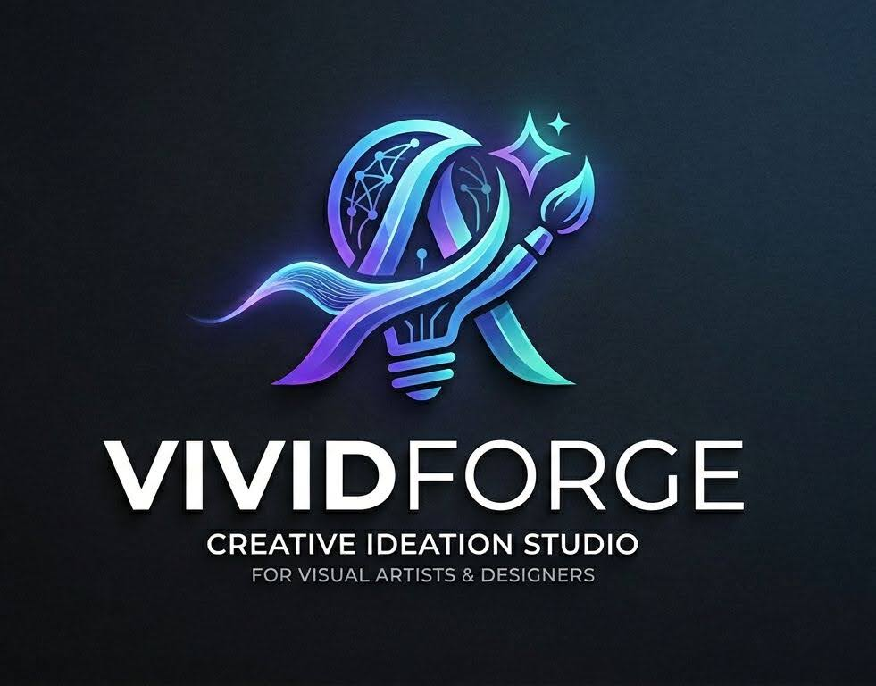

<div align="center">



# VividForge

**AI-Powered Creative Ideation & Multimodal Platform**

[](https://opensource.org/licenses/MIT)
[](https://ibm.biz/university-bob)
[](https://www.ibm.com/watsonx)
[](https://www.ibm.com/granite)
[](https://elevenlabs.io/)

> Transform creative sparks into detailed concepts, stories, visuals, voice, and video with IBM watsonx.ai, Granite models, and ElevenLabs. Professional-grade AI tools for visual artists, designers, storytellers, and creative professionals.

[🚀 Live Demo](https://paulmmoore3416.github.io/vividforge/) | [📖 Documentation](./docs/) | [🎥 Video Demo](./assets/)

</div>

---

## 🌟 Overview

VividForge is a comprehensive AI-powered creative platform that combines advanced concept generation with multimodal storytelling, visual design, voice synthesis, video generation, and interactive scene building. Built on IBM watsonx.ai, Granite models, and ElevenLabs, it provides professional creators with intelligent tools to accelerate their creative workflow.

### 🎯 Key Capabilities

- **✨ Advanced Concept Generation** - Transform 1-sentence ideas into comprehensive creative briefs
- **📝 AI Story Architect** - Generate compelling narratives across multiple genres
- **🎨 Visual Design Studio** - Create detailed visual concepts and mood boards
- **🎙️ Voice Generation** - Professional text-to-speech with emotion control (ElevenLabs)
- **🎬 Video Generation** - Create stunning 6-second cinematic videos
- **🌍 Translation Hub** - Translate between 12 languages with pronunciation guides (NEW!)
- **🎭 Interactive Scene Builder** - Build immersive scenes with branching narratives
- **🤝 Collaboration Hub** - Real-time collaborative workspace

---

## 🚀 Features

### ✨ Advanced Concept Generator

Transform brief ideas into comprehensive creative concepts:

- **Intelligent Analysis**: AI understands your vision and expands it into detailed briefs
- **Color Palettes**: Curated color schemes with hex codes and usage guidelines
- **Composition Guidelines**: Professional layout, balance, and focal point recommendations
- **Image Prompts**: Optimized prompts for Stable Diffusion, DALL-E, and Midjourney
- **Technical Specifications**: Lighting, camera settings, and material suggestions
- **Inspiration References**: Relevant artistic movements, techniques, and artists
- **Export Options**: JSON, Markdown, and standalone prompt files

### 🎙️ Voice Generator (NEW!)

Professional text-to-speech powered by ElevenLabs:

- **10 Premium Voices**: From calm professionals to mystical narrators
- **Emotion Control**: Neutral, excited, calm, dramatic, mysterious, energetic, sad, angry
- **Advanced Settings**: Stability and similarity boost controls
- **Narration Mode**: Optimized for storytelling with natural pauses
- **High Quality**: Multilingual support with natural-sounding speech
- **Instant Preview**: Real-time audio playback and download

### 🎬 Video Generator (NEW!)

Create stunning 6-second cinematic videos:

- **3-Scene Composition**: Establishing shot, detail, and dramatic finale
- **5 Visual Styles**: Cinematic, artistic, realistic, abstract, vintage
- **Ken Burns Effect**: Professional zoom and pan animations
- **Color Grading**: Automatic cinematic color correction
- **Smooth Transitions**: Fade, dissolve, and cut options
- **Background Music**: Ambient, cinematic, electronic, acoustic
- **Voiceover Support**: Integrated voice narration
- **1920x1080 @ 30fps**: Social media optimized

### 🌍 Translation Hub (NEW!)

Professional multi-language translation powered by IBM Granite:

- **12 Languages**: English, Spanish, Arabic, Japanese, Chinese (Simplified/Traditional), Ukrainian, Russian, Nigerian Pidgin, Korean, Farsi
- **Auto-Detection**: Automatically identify source language
- **Formality Control**: Neutral, formal, or casual tone
- **7 Translation Styles**: Default, literal, idiomatic, business, literary, technical, casual-chat
- **Length Options**: Auto-match, concise, or detailed translations
- **Pronunciation Guides**: IPA transcription, syllable breakdown, stress patterns
- **Cultural Localization**: Idioms and cultural context adaptation
- **Alternative Translations**: Multiple phrasing options with explanations
- **Voice Playback**: Integrated ElevenLabs TTS for pronunciation
- **Translation History**: Save and revisit recent translations
- **Batch Translation**: Translate multiple texts at once
- **Domain Expertise**: Specify subject area for accurate terminology

### 📝 AI Story Architect

Generate compelling narratives with:

- **Multiple Genres**: Fantasy, Sci-Fi, Mystery, Romance, Thriller, and more
- **Tone Control**: Adventurous, dramatic, serene, mysterious, uplifting
- **Length Options**: Short, medium, long-form content
- **Style Variations**: Narrative, descriptive, dialogue-heavy, poetic
- **Enhancement Tools**: AI-powered content refinement
- **Plot Suggestions**: Intelligent recommendations for story development

### 🎨 Visual Design Studio

Create detailed visual concepts:

- **Style Selection**: Cinematic, minimalist, surreal, photorealistic, abstract
- **Mood Definition**: Dramatic, serene, energetic, mysterious
- **Color Theory**: Vibrant, muted, monochrome, warm, cool palettes
- **Composition Rules**: Rule of thirds, golden ratio, leading lines
- **Lighting Design**: High-contrast, soft-diffused, natural, dramatic
- **Element Breakdown**: Foreground, midground, background specifications

### 🎭 Interactive Scene Builder

Build immersive interactive experiences:

- **Scene Types**: Interactive, cinematic, exploratory, puzzle-based
- **Complexity Levels**: Simple, medium, complex scene structures
- **Branching Narratives**: Multiple story paths and outcomes
- **Character Interactions**: Dialogue, movement, decision points
- **Environmental Elements**: Dynamic world-building components
- **Export Specifications**: Ready-to-implement scene designs

### 🤝 Collaboration Hub

Work together with AI assistance:

- **Real-time Sessions**: Collaborative workspace for teams
- **AI Brainstorming**: Intelligent creative suggestions
- **Activity Tracking**: Version history and change logs
- **Shared Projects**: Team coordination and management
- **Feedback Integration**: Iterative refinement with team input

---

## 🏗️ Technology Stack

### Core Technologies

- **AI Platform**: IBM watsonx.ai with Granite 3-8B Instruct
- **Voice AI**: ElevenLabs Multilingual V2
- **Video Processing**: FFmpeg with advanced filters
- **Backend**: Node.js with Express
- **Frontend**: Vanilla JavaScript (ES6+) with Vite
- **Design System**: Custom Hero-Glass hybrid CSS
- **Development**: Built entirely with IBM Bob

### AI Integration

- **Primary Model**: IBM Granite 3-8B Instruct
- **Voice Engine**: ElevenLabs API
- **SDK**: @ibm-cloud/watsonx-ai v1.7.13
- **Authentication**: IBM Cloud IAM
- **Fallback**: Mock mode for development/demo

### Architecture

```
VividForge Studio
├── Frontend (Vite + Vanilla JS)
│   ├── Concept Generator Module
│   ├── Story Architect Module
│   ├── Visual Design Module
│   ├── Voice Generator Module (NEW)
│   ├── Video Generator Module (NEW)
│   ├── Scene Builder Module
│   └── Collaboration Hub Module
├── Backend (Express API)
│   ├── AI Engine Service (watsonx.ai)
│   ├── Voice Engine Service (ElevenLabs)
│   ├── Video Engine Service (FFmpeg)
│   ├── Story Generation Routes
│   ├── Visual Concept Routes
│   ├── Voice Generation Routes (NEW)
│   ├── Video Generation Routes (NEW)
│   ├── Scene Building Routes
│   └── Collaboration Routes
└── AI Layer
    ├── IBM watsonx.ai (Granite Models)
    └── ElevenLabs (Voice Synthesis)
```

---

## 📦 Installation

### Prerequisites

- Node.js 16+ and npm
- Git
- (Optional) IBM watsonx.ai API credentials
- (Optional) ElevenLabs API key

### Quick Start

1. **Clone the repository**
   ```bash
   git clone https://github.com/paulmmoore3416/vividforge.git
   cd vividforge
   ```

2. **Install dependencies**
   ```bash
   npm install
   ```

3. **Configure environment**
   ```bash
   cp .env.example .env
   ```
   
   Edit `.env` and add your API keys:
   ```env
   # IBM watsonx.ai (optional - works in mock mode without)
   WATSONX_API_KEY=your_api_key_here
   WATSONX_PROJECT_ID=your_project_id_here
   WATSONX_URL=https://us-south.ml.cloud.ibm.com
   WATSONX_MODEL_ID=ibm/granite-3-8b-instruct
   
   # ElevenLabs Voice (optional - works in mock mode without)
   ELEVENLABS_API_KEY=your_elevenlabs_key_here
   
   # For demo without API keys
   ENABLE_MOCK_MODE=true
   ```

4. **Start the development server**
   ```bash
   npm run dev
   ```

5. **Open your browser**
   - Frontend: http://localhost:5173
   - API: http://localhost:3000

### Production Build

```bash
npm run build
npm run preview
```

### Deployment

```bash
npm run deploy
```

---

## 🎓 Getting API Credentials

### IBM watsonx.ai

1. Visit [IBM Cloud](https://cloud.ibm.com/registration)
2. Create a free account or sign in
3. Navigate to IBM watsonx.ai
4. Create a new project
5. Generate API credentials
6. Copy your API key and Project ID to `.env`

### ElevenLabs

1. Visit [ElevenLabs](https://elevenlabs.io/)
2. Create an account (free tier available)
3. Navigate to Profile Settings
4. Generate API key
5. Copy your API key to `.env`

---

## 📖 Usage Guide

### Creating a Concept

1. Navigate to **Concept Generator**
2. Describe your creative vision
3. Select visual style and mood
4. Add optional context
5. Click **Generate Concept**
6. Review comprehensive concept breakdown
7. Export or refine as needed

### Generating Voice

1. Open **Voice Generator**
2. Enter text to convert to speech
3. Choose voice and emotion
4. Adjust stability and similarity settings
5. Click **Generate Voice** or **Generate Narration**
6. Preview audio and download

### Creating Videos

1. Access **Video Generator**
2. Describe your video concept
3. Select style, transition, and music
4. Enable Ken Burns effect and color grading
5. Add optional voiceover text
6. Click **Generate 6-Second Video**
7. Preview and download your cinematic video

### Generating Stories

1. Open **Story Architect**
2. Enter your story prompt
3. Choose genre, tone, and length
4. Click **Generate Story**
5. Use **Enhance** to refine content
6. Get **Suggestions** for plot development
7. Export in Markdown format

---

## 🤖 IBM Bob Integration

This project was built entirely using **IBM Bob** as the primary development tool, demonstrating:

- ✅ **Spec-driven development** for rapid prototyping
- ✅ **AI-assisted coding** for complex logic implementation
- ✅ **Iterative refinement** through conversational development
- ✅ **Best practices** in modern web development
- ✅ **Architecture design** through AI collaboration
- ✅ **Documentation generation** with AI assistance

---

## 🎯 Challenge Alignment

### July 2026 AI Builders Challenge

VividForge directly addresses the challenge theme: **Reimagine Creative Industries with AI**

✅ **Transforming creativity** through AI-powered tools  
✅ **Enabling faster content creation** with intelligent assistance  
✅ **Unlocking new creative experiences** through multimodal generation  
✅ **Bridging imagination and execution** with intuitive interfaces  
✅ **Acting as a creative partner** rather than just a generator

### Required Technologies

✅ **IBM Bob** - Primary development tool (100% of development)  
✅ **AI Core Component** - IBM watsonx.ai + ElevenLabs integrated throughout  
✅ **Modern Stack** - Node.js, Express, Vite, ES6+

---

## 📊 Project Metrics

| Metric | Value |
|--------|-------|
| **Lines of Code** | 8,000+ |
| **Modules** | 8 core modules |
| **API Endpoints** | 25+ routes |
| **AI Models** | IBM Granite 3-8B + ElevenLabs V2 |
| **Features** | 7 major creative tools |
| **Development Time** | Built with IBM Bob |

---

## 🔮 Future Enhancements

- [ ] Real-time multiplayer collaboration with WebSockets
- [ ] Advanced visual generation with DALL-E integration
- [ ] Longer video generation (up to 60 seconds)
- [ ] Voice cloning capabilities
- [ ] Export to screenplay, novel, and game formats
- [ ] Mobile application (iOS/Android)
- [ ] Plugin system for extensibility
- [ ] Cloud storage and project management
- [ ] Analytics and insights dashboard
- [ ] Community marketplace for templates

---

## 🤝 Contributing

Contributions are welcome! Please feel free to submit a Pull Request.

1. Fork the repository
2. Create your feature branch (`git checkout -b feature/AmazingFeature`)
3. Commit your changes (`git commit -m 'Add some AmazingFeature'`)
4. Push to the branch (`git push origin feature/AmazingFeature`)
5. Open a Pull Request

---

## 📄 License

This project is licensed under the MIT License - see the [LICENSE](LICENSE) file for details.

---

## 👨‍💻 Author

**Paul Moore**
- GitHub: [@paulmmoore3416](https://github.com/paulmmoore3416)
- Email: paulmmoore3416@gmail.com

---

## 🙏 Acknowledgments

- **IBM Bob** for enabling rapid AI-assisted development
- **IBM watsonx.ai** for enterprise-grade AI capabilities
- **IBM Granite Models** for high-quality content generation
- **ElevenLabs** for professional voice synthesis
- **July AI Builders Challenge** for the opportunity
- The open-source community for inspiration and tools

---

## 📞 Support

For questions, issues, or feedback:
- Open an issue on [GitHub](https://github.com/paulmmoore3416/vividforge/issues)
- Join the discussion in the AI Builders Challenge Discord
- Email: paulmmoore3416@gmail.com

---

<div align="center">

**Built with ❤️ using IBM Bob for the July 2026 AI Builders Challenge**

*VividForge - Where AI Meets Creativity*

**Powered by IBM watsonx.ai, Granite Models, and ElevenLabs**

</div>